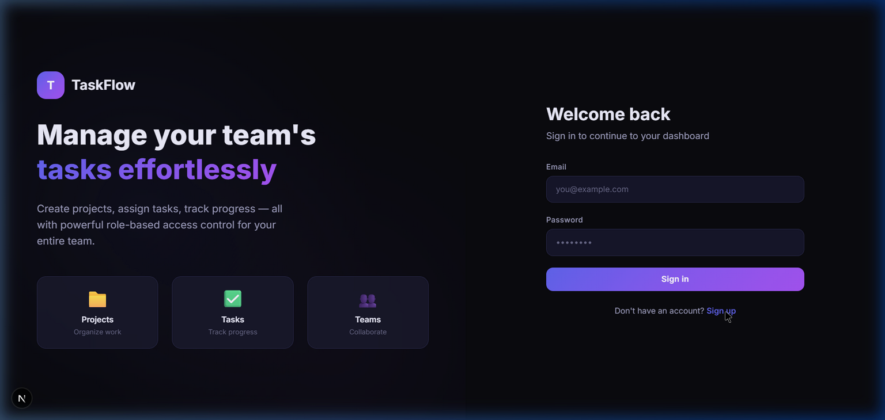
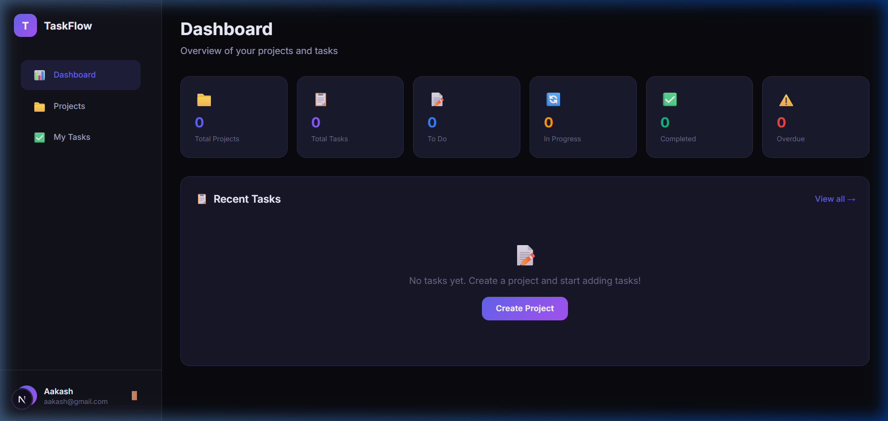
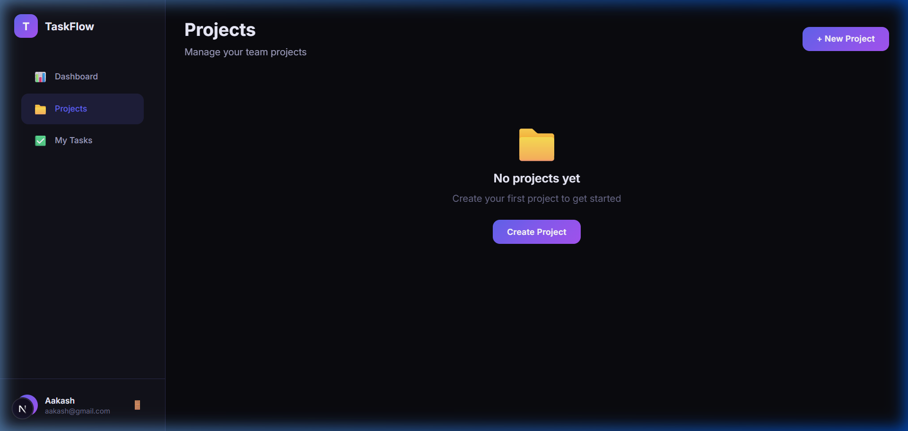

<p align="center">
  
  
  
  
  
</p>

# 🚀 TaskFlow — Team Task Manager

> A full-stack web application for team collaboration — create projects, assign tasks to team members, and track progress with real-time dashboards and role-based access control (Admin/Member).

<p align="center">
  
</p>

---

## 📋 Table of Contents

- [Features](#-features)
- [Screenshots](#-screenshots)
- [Tech Stack](#-tech-stack)
- [Architecture](#-architecture)
- [Getting Started](#-getting-started)
- [Environment Variables](#-environment-variables)
- [API Documentation](#-api-documentation)
- [Database Schema](#-database-schema)
- [Project Structure](#-project-structure)
- [Role-Based Access Control](#-role-based-access-control)

---

## ✨ Features

### 🔐 Authentication
- User **Signup** and **Login** with form validation
- **JWT (JSON Web Token)** based authentication
- Passwords hashed with **bcrypt** (12 salt rounds)
- Persistent sessions via `localStorage`
- Auto-logout on token expiry

### 📁 Project Management
- Create, update, and delete projects
- Add/remove team members by email
- Assign roles: **Admin** or **Member**
- Project owner has full control

### ✅ Task Management
- Create tasks with **title**, **description**, **priority**, and **due date**
- Assign tasks to specific team members
- Track task status: `To Do` → `In Progress` → `Completed`
- Priority levels: `Low`, `Medium`, `High`
- Quick inline status updates
- Filter tasks by status and priority
- Overdue task detection

### 📊 Dashboard
- Real-time stats overview (projects, tasks, status breakdown)
- **Overdue tasks** highlighted with warnings
- **High priority** tasks section
- Recent activity feed
- Quick navigation to projects and tasks

### 👥 Role-Based Access Control (RBAC)
| Permission | Admin | Member |
|---|---|---|
| Create tasks | ✅ | ✅ |
| Update task status | ✅ | ✅ |
| Edit task details | ✅ | ❌ |
| Delete tasks | ✅ | ❌ |
| Add/remove members | ✅ | ❌ |
| Edit project | ✅ | ❌ |
| Delete project | Owner only | ❌ |

---

## 📸 Screenshots

<p align="center">
  <strong>Dashboard</strong><br/>
  
</p>

<p align="center">
  <strong>Projects</strong><br/>
  
</p>

---

## 🛠 Tech Stack

| Layer | Technology |
|---|---|
| **Frontend** | React 19, Next.js 16 (App Router) |
| **Styling** | Tailwind CSS 4 + Custom CSS (Glassmorphism, Animations) |
| **Backend** | Next.js API Routes (REST) |
| **Database** | MongoDB 7.0 with Mongoose ODM |
| **Authentication** | JWT (jsonwebtoken) + bcryptjs |
| **Language** | JavaScript (ES6+), JSX |

---

## 🏗 Architecture

```
┌─────────────────────────────────────────────────┐
│                    Client (React)                │
│  ┌───────────┐  ┌──────────┐  ┌──────────────┐  │
│  │  Auth      │  │ Dashboard│  │  Projects &  │  │
│  │  Context   │  │  Page    │  │  Tasks Pages │  │
│  └─────┬─────┘  └────┬─────┘  └──────┬───────┘  │
│        │              │               │          │
│        └──────────────┴───────────────┘          │
│                       │                          │
│              useApi() Hook (JWT)                 │
└───────────────────────┬─────────────────────────┘
                        │ HTTP (REST)
┌───────────────────────┴─────────────────────────┐
│              Next.js API Routes                  │
│  ┌──────────┐ ┌───────────┐ ┌────────────────┐  │
│  │ /auth/*  │ │ /projects │ │ /tasks, /dash  │  │
│  └────┬─────┘ └─────┬─────┘ └───────┬────────┘  │
│       │              │               │           │
│       └──────────────┴───────────────┘           │
│                      │                           │
│         JWT Verification + RBAC Middleware        │
└──────────────────────┬──────────────────────────┘
                       │
┌──────────────────────┴──────────────────────────┐
│              MongoDB (Mongoose)                  │
│  ┌─────────┐  ┌───────────┐  ┌───────────────┐  │
│  │  Users  │  │  Projects │  │    Tasks      │  │
│  └─────────┘  └───────────┘  └───────────────┘  │
└─────────────────────────────────────────────────┘
```

---

## 🚀 Getting Started

### Prerequisites

- **Node.js** ≥ 18
- **MongoDB** ≥ 6.0 (local or [MongoDB Atlas](https://www.mongodb.com/atlas))
- **npm** or **yarn**

### Installation

```bash
# 1. Clone the repository
git clone https://github.com/your-username/task-manager.git
cd task-manager

# 2. Install dependencies
npm install

# 3. Create environment file
cp .env.example .env.local

# 4. Update .env.local with your MongoDB URI and JWT secret

# 5. Start MongoDB (if local)
mongod --dbpath /data/db

# 6. Run the development server
npm run dev
```

Open [http://localhost:3000](http://localhost:3000) in your browser.

---

## 🔑 Environment Variables

Create a `.env.local` file in the root directory:

```env
MONGODB_URI=mongodb://localhost:27017/task-manager
JWT_SECRET=your-super-secret-jwt-key-change-in-production
```

| Variable | Description | Required |
|---|---|---|
| `MONGODB_URI` | MongoDB connection string | ✅ |
| `JWT_SECRET` | Secret key for signing JWT tokens | ✅ |

---

## 📡 API Documentation

### Authentication

| Method | Endpoint | Description | Auth |
|---|---|---|---|
| `POST` | `/api/auth/signup` | Register a new user | ❌ |
| `POST` | `/api/auth/login` | Login & get JWT token | ❌ |
| `GET` | `/api/auth/me` | Get current user profile | ✅ |

#### Signup Request
```json
POST /api/auth/signup
{
  "name": "John Doe",
  "email": "john@example.com",
  "password": "securepass123"
}
```

#### Login Response
```json
{
  "message": "Login successful",
  "token": "eyJhbGciOiJIUzI1...",
  "user": {
    "id": "64a...",
    "name": "John Doe",
    "email": "john@example.com"
  }
}
```

### Projects

| Method | Endpoint | Description | Auth |
|---|---|---|---|
| `GET` | `/api/projects` | List user's projects | ✅ |
| `POST` | `/api/projects` | Create new project | ✅ |
| `GET` | `/api/projects/:id` | Get project details + tasks | ✅ |
| `PUT` | `/api/projects/:id` | Update project (Admin) | ✅ |
| `DELETE` | `/api/projects/:id` | Delete project (Owner) | ✅ |
| `POST` | `/api/projects/:id/members` | Add member | ✅ |
| `DELETE` | `/api/projects/:id/members` | Remove member | ✅ |

### Tasks

| Method | Endpoint | Description | Auth |
|---|---|---|---|
| `GET` | `/api/tasks` | List all tasks (filterable) | ✅ |
| `POST` | `/api/tasks` | Create new task | ✅ |
| `GET` | `/api/tasks/:id` | Get task details | ✅ |
| `PUT` | `/api/tasks/:id` | Update task | ✅ |
| `DELETE` | `/api/tasks/:id` | Delete task (Admin) | ✅ |

### Dashboard

| Method | Endpoint | Description | Auth |
|---|---|---|---|
| `GET` | `/api/dashboard` | Get aggregated stats | ✅ |

---

## 🗃 Database Schema

### User
```javascript
{
  name:      String,       // Required, 2-50 chars
  email:     String,       // Required, unique, lowercase
  password:  String,       // Hashed with bcrypt
  createdAt: Date,
  updatedAt: Date
}
```

### Project
```javascript
{
  name:        String,                    // Required, 2-100 chars
  description: String,                    // Optional, max 500 chars
  owner:       ObjectId → User,           // Project creator
  members: [{
    user: ObjectId → User,
    role: "admin" | "member"              // Role-based access
  }],
  createdAt:   Date,
  updatedAt:   Date
}
```

### Task
```javascript
{
  title:       String,                    // Required, 2-200 chars
  description: String,                    // Optional, max 1000 chars
  status:      "todo" | "in-progress" | "completed",
  priority:    "low" | "medium" | "high",
  project:     ObjectId → Project,        // Parent project
  assignee:    ObjectId → User | null,    // Assigned team member
  createdBy:   ObjectId → User,           // Task creator
  dueDate:     Date | null,
  createdAt:   Date,
  updatedAt:   Date
}
```

**Indexes:** `{ project, status }`, `{ assignee }`, `{ dueDate }`

---

## 📂 Project Structure

```
task-manager/
├── src/
│   ├── app/
│   │   ├── api/
│   │   │   ├── auth/
│   │   │   │   ├── login/route.js       # POST - User login
│   │   │   │   ├── signup/route.js      # POST - User registration
│   │   │   │   └── me/route.js          # GET  - Current user
│   │   │   ├── dashboard/route.js       # GET  - Dashboard stats
│   │   │   ├── projects/
│   │   │   │   ├── route.js             # GET/POST - List/Create
│   │   │   │   └── [id]/
│   │   │   │       ├── route.js         # GET/PUT/DELETE - CRUD
│   │   │   │       └── members/route.js # POST/DELETE - Members
│   │   │   └── tasks/
│   │   │       ├── route.js             # GET/POST - List/Create
│   │   │       └── [id]/route.js        # GET/PUT/DELETE - CRUD
│   │   ├── dashboard/
│   │   │   ├── layout.jsx
│   │   │   └── page.jsx                 # Dashboard view
│   │   ├── projects/
│   │   │   ├── layout.jsx
│   │   │   ├── page.jsx                 # Projects list
│   │   │   └── [id]/
│   │   │       ├── layout.jsx
│   │   │       └── page.jsx             # Project detail + tasks
│   │   ├── tasks/
│   │   │   ├── layout.jsx
│   │   │   └── page.jsx                 # All tasks view
│   │   ├── globals.css                  # Design system
│   │   ├── layout.jsx                   # Root layout
│   │   └── page.jsx                     # Landing (Login/Signup)
│   ├── components/
│   │   └── AppLayout.jsx                # Sidebar navigation
│   ├── context/
│   │   └── AuthContext.jsx              # Auth state management
│   ├── hooks/
│   │   └── useApi.js                    # API fetch with JWT
│   ├── lib/
│   │   ├── auth.js                      # JWT & bcrypt utilities
│   │   └── db.js                        # MongoDB connection
│   └── models/
│       ├── User.js                      # User schema
│       ├── Project.js                   # Project schema
│       └── Task.js                      # Task schema
├── .env.local                           # Environment variables
├── jsconfig.json                        # Path aliases
├── next.config.mjs                      # Next.js config
├── package.json
└── README.md
```

---

## 🔒 Role-Based Access Control

The application implements a **two-tier role system** per project:

### Admin
- Full CRUD on tasks (create, read, update all fields, delete)
- Add/remove project members
- Edit project details
- Project owner (special admin) can delete the project

### Member
- Create tasks
- Update **only task status** (To Do ↔ In Progress ↔ Completed)
- View all project tasks and members
- Cannot modify task details, delete tasks, or manage members

**Implementation:** Role checks are enforced at the **API level** — every protected endpoint verifies the user's JWT token and checks their role in the project's `members` array before allowing the operation.

---

## 📄 License

This project is open source and available under the [MIT License](LICENSE).

---

<p align="center">
  Built with ❤️ using Next.js, MongoDB & React
</p>
